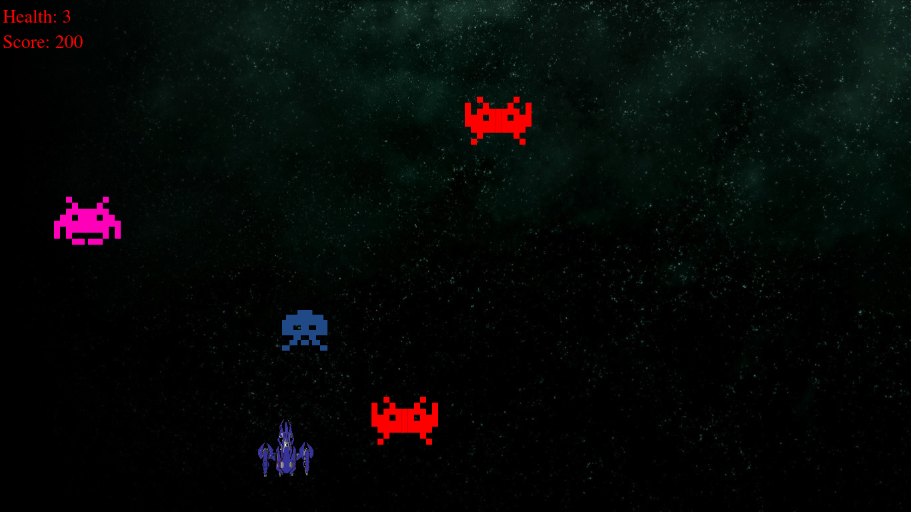

# SpaceInvaders_Qt_Cpp

## Installation
Install qt5 libs and qmake
```
sudo apt install qt5-qmake qtbase5-dev
```

Build the app
```
mkdir  build
cd build
qmake ../
make -j12
```
Start space invaders
```
./Space_invaders
```

## Instructions

Press Right, left to move. Space to shoot. Press V to change color.



